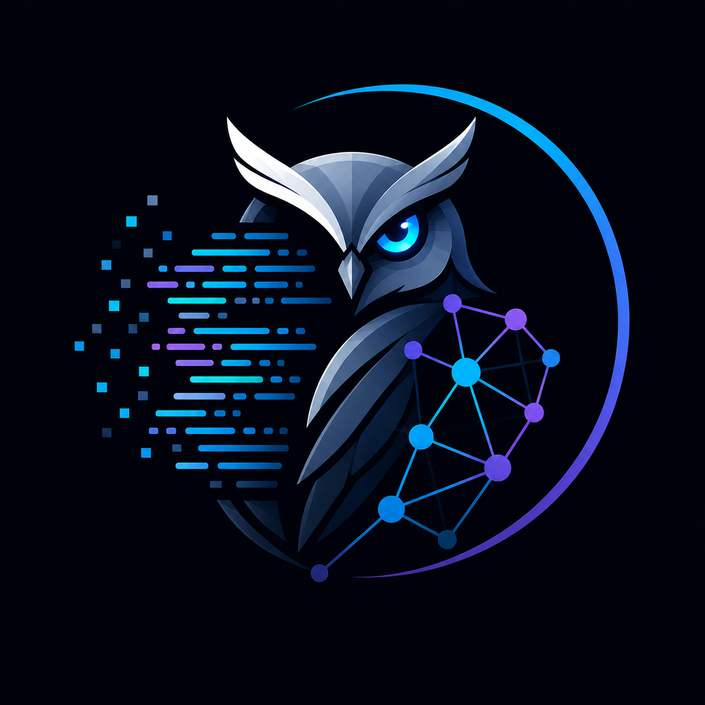

<p align="center">
  
</p>

<p align="center">
  <strong>The codebase analyzer that sees what others miss.</strong><br>
  Specialist static analysis for legacy Java / Spring / Hibernate codebases —<br>
  migration blockers, fetch-strategy disasters, transaction propagation bugs,<br>
  package cycles, and the whole mess quantified in € (or $, £, ¥...).
</p>

[](LICENSE)
[](#requirements)
[](https://github.com/codebase-analyzer/core/actions/workflows/ci.yml)
[](https://github.com/codebase-analyzer/core/releases/latest)

---

## Why Code Owl exists

Sonar, PMD and SpotBugs are great generalists. They're shallow on the things that actually break
production Java systems: **Hibernate fetch cycles, `@Transactional` propagation traps, Spring proxy
self-invocation bugs, JPA migration blockers.** Code Owl is the opposite — a specialist that goes
deep on a narrow target: **the Java / Spring / Hibernate legacy modernization workflow.**

If you're staring down a Java 8→17 migration, a Spring Boot 2→3 upgrade, or a Hibernate 5→6 jump
*and* your codebase has been alive for 5+ years, this is for you.

## Quick start

**Option A — Download the latest release (fastest):**

```bash
# One command. Needs JRE 8+ on your PATH. No Maven required.
curl -sSL -o code-owl.jar https://github.com/codebase-analyzer/core/releases/latest/download/analyzer-cli.jar
java -jar code-owl.jar /path/to/project

# Open the report
open analyzer-output/analysis-report.html
```

**Option B — Build from source:**

```bash
mvn clean package -DskipTests
java -jar analyzer-cli/target/analyzer-cli-*.jar /path/to/project
```

That's it. No server, no SaaS account, no telemetry. The HTML report is a single file you can email.

## What you get

The HTML report has 8 pages and three audience modes (dev / lead / exec):

```
┌─────────────────────────────────────────────────────────────┐
│  Overview         KPI cards · trend deltas · top risks       │
│  Priority         Top-10 fixes ranked by impact × git churn  │
│  Findings         Full list with filters + per-rule pages    │
│  Migration        Java/Spring/Hibernate readiness scoring    │
│  Architecture     Package cycles · layering · god classes    │
│  Security         Dependency CVEs (CVSS-scored)              │
│  Dependencies     Detected frameworks + versions             │
│  Project Stats    File counts, severity bars                 │
└─────────────────────────────────────────────────────────────┘
```

**Key features:**

- **Migration Readiness Assessment** — scores Java 8→17, Spring Boot 2→3, Hibernate 5→6 paths.
  Flags every concrete blocker with file:line and the fix.
- **Architecture analysis** — detects package dependency cycles (Tarjan's SCC), layering violations
  (Controller→Repository skipping Service, Entity→Service, etc.), and god classes.
- **Cross-method transactional analysis** — catches silent bugs PMD/Sonar can't:
  `@Transactional` on private/final methods, `REQUIRES_NEW` self-invocation, missing-`readOnly`,
  write-without-transaction service methods.
- **Hibernate fetch deep-dive** — bidirectional EAGER cycles, EAGER collections, missing `@BatchSize`,
  N+1 patterns.
- **Risk-weighted prioritization** — combines severity, confidence, git churn (last 12 months), and
  blast radius into an impact score. Surfaces the top-10 things actually worth fixing.
- **Tech debt in money** — calibrated effort table × hourly rate. Shows €317k of debt, not "1,240 findings."
- **Educational findings** — every finding explains *what it means*, *why it matters in production*,
  the *common misunderstandings*, the *fix*, and *when to legitimately suppress it*. Reading the
  report teaches you the codebase's failure modes.
- **Trend tracking** — baseline mechanism shows "+12 critical / -€8k debt since last run." Works
  beautifully in CI for PR-level deltas.
- **CVE scanning** — bundled curated database, no HTTP dependencies, works offline.

## CI / PR integration

Code Owl ships ready-to-use templates for both **GitHub Actions** and **GitLab CI**:

| Platform | Templates | What you get |
|---|---|---|
| [GitHub Actions](docs/integrations/github-actions/) | `basic.yml` · `pr-delta.yml` · `action.yml` | Scan on push/PR, upload HTML, post PR comments with trend deltas, optionally publish a one-line Marketplace action |
| [GitLab CI](docs/integrations/gitlab-ci/) | `basic.gitlab-ci.yml` · `mr-delta.gitlab-ci.yml` | Scan on push/MR, upload HTML, post MR comments with trend deltas via REST API |

See [`docs/integrations/`](docs/integrations/) for the full integration menu.

## Sample output (Markdown summary mode)

> ## 🟠 Code Owl report
>
> ### ❌ Trend: Regressed since baseline
>
> | Metric | Current | Δ vs baseline |
> |---|---:|---:|
> | Total findings | 10,441 | 🔴 ↑ 12 |
> | Critical | 5,039 | 🔴 ↑ 3 |
> | Tech-debt cost | €317k | 🔴 ↑ €1k |
>
> ### Top priority fixes
>
> | # | Impact | Severity | Effort | Finding |
> |---:|---:|---|---|---|
> | 1 | 100/100 | CRITICAL | MEDIUM (~1h) | Bidirectional EAGER cycle detected |
> | 2 | 86/100 | HIGH | MEDIUM (~1h) | EAGER fetch on collection |

## CLI reference

```
java -jar analyzer-cli.jar <PROJECT_PATH> [options]

  -o, --output <DIR>            Output directory (default: ./analyzer-output)
      --json                    Generate JSON report
      --no-html                 Skip HTML report
  -v, --verbose                 Print findings to console
      --baseline <FILE>         Filter findings present in baseline + enable trend deltas
      --write-baseline <FILE>   Persist current findings as a baseline and exit
      --markdown-summary <FILE> Compact Markdown summary for PR comments
      --mode <MODE>             Report mode: dev | lead | exec (default: dev)
      --currency <CODE>         ISO-4217 currency code (default: EUR)
      --rate-per-hour <RATE>    Hourly rate for tech-debt cost (default: 100)
      --no-git                  Skip git churn (severity-only impact scoring)
      --git-window-months <N>   Months of git history to consider (default: 12)
```

## How it compares

|  | Code Owl | SonarQube CE | PMD | SpotBugs | JArchitect |
|---|---|---|---|---|---|
| Spring `@Transactional` propagation analysis | ✅ | ⚠️ partial | ❌ | ❌ | ❌ |
| Hibernate bidirectional EAGER cycle detection | ✅ | ❌ | ❌ | ❌ | ❌ |
| Migration readiness scoring (8→17, Boot 2→3) | ✅ | ❌ | ❌ | ❌ | ❌ |
| Tech debt in money (configurable rate, currency) | ✅ | 💰 paid only | ❌ | ❌ | ❌ |
| Architecture cycles + layering violations | ✅ | 💰 paid only | ❌ | ❌ | ✅ |
| Git-aware impact prioritization | ✅ | 💰 paid only | ❌ | ❌ | ❌ |
| Self-contained HTML (no server) | ✅ | ❌ | ⚠️ | ⚠️ | ❌ |
| Offline-safe CVE scanning | ✅ | ❌ | ❌ | ❌ | ❌ |

**TL;DR:** Sonar wins on language coverage. Code Owl wins on Java/Spring/Hibernate depth and on "ship a single HTML you can email to the CTO."

## Editions

| Tier | Audience | What's in it |
|---|---|---|
| **Code Owl Free (OSS)** — this repo | Solo devs, evaluators, OSS projects | CLI scan, single-project HTML, all analyzers, baseline + trend, dev/lead/exec modes |
| **Code Owl Team** *(forthcoming)* | Engineering teams | OSS CLI + SaaS dashboard, multi-run history, GitHub PR comments at scale, Slack/Teams alerts, live CVE DB updates |
| **Code Owl Enterprise** *(forthcoming)* | Fortune 500 / regulated | Team + multi-project rollup, runtime JFR instrumentation, custom rules, SAML SSO, air-gapped on-prem, SLA |

## Requirements

- **JRE 8 or later** to run (the analyzer is compiled for Java 8 bytecode).
- **Java 17 + Maven 3.8+** to build from source.
- Optional: `git` on PATH for churn-based impact scoring.

## Roadmap

See [docs/IMPROVEMENT_PLAN.md](docs/IMPROVEMENT_PLAN.md) for strategy and the next-12-months feature roadmap.

## Contributing

PRs welcome. The code follows the existing style (Java 8 target, no external runtime deps except
what's in `pom.xml`). Add new analyzers by implementing `dev.codeanalyzer.core.analyzer.Analyzer`
and registering them in `AnalyzerCli.java`. See `CLAUDE.md` for an architecture overview.

## License

[Apache License 2.0](LICENSE). See [NOTICE](NOTICE) for third-party attributions.

---

<sub>Code Owl is the commercial brand. The technical project name in source / Maven coordinates remains `codebase-analyzer` for stability.</sub>
